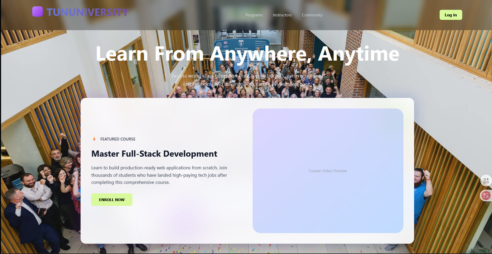
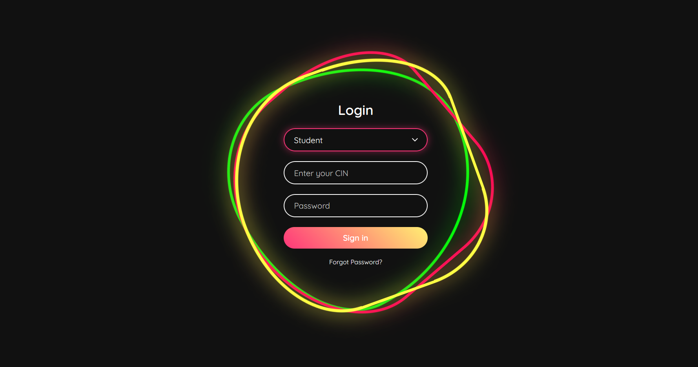
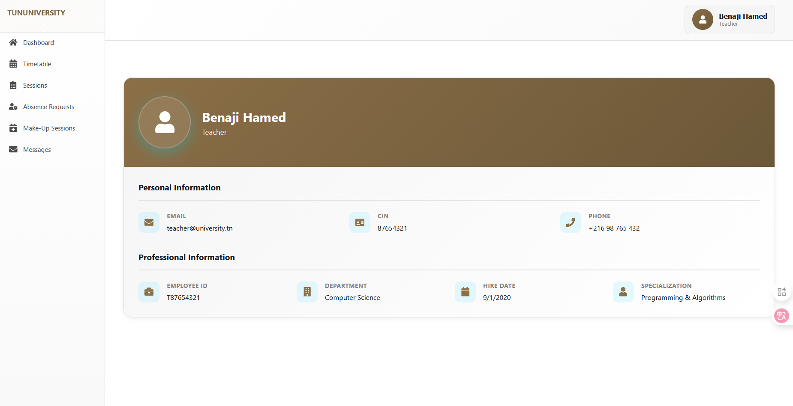
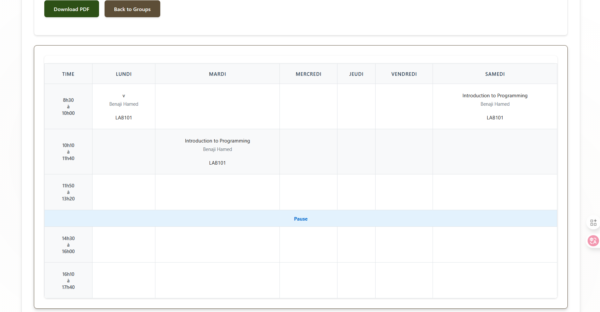
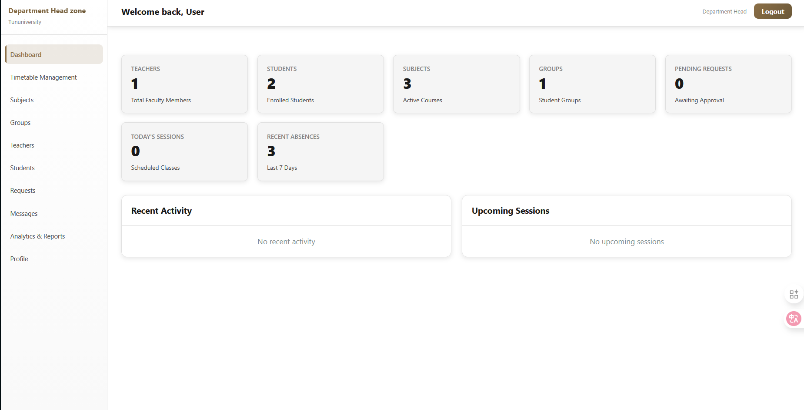

# Tununiversity - University Management System

<div align="center">



[](https://www.docker.com/)
[](https://nodejs.org/)
[](https://reactjs.org/)
[](https://www.postgresql.org/)
[](LICENSE)

**A comprehensive, modern university management platform built with microservices architecture**

[Features](#-features) • [Architecture](#-architecture) • [Getting Started](#-getting-started) • [Services](#-services) • [Documentation](#-documentation)

</div>

---

##  Table of Contents

- [Overview](#-overview)
- [Features](#-features)
- [Architecture](#-architecture)
- [Technology Stack](#-technology-stack)
- [Getting Started](#-getting-started)
- [Services Overview](#-services-overview)
- [Screenshots](#-screenshots)
- [API Documentation](#-api-documentation)
- [Contributing](#-contributing)
- [License](#-license)

---

##  Overview

Tununiversity is a full-featured university management system designed to streamline academic operations for students, teachers, administrators, and department heads. Built with a modern microservices architecture, it provides a scalable, maintainable, and efficient solution for educational institutions.

### Key Highlights

- 🏗️ **Microservices Architecture** - Scalable and independently deployable services
- 🐳 **Docker Containerized** - Easy deployment and environment consistency
- 🔐 **Role-Based Access Control** - Secure authentication for Students, Teachers, Admins, and Department Heads
- 📱 **Responsive Design** - Works seamlessly across desktop, tablet, and mobile devices
- ⚡ **Real-time Updates** - Live notifications and messaging system
- 📊 **Analytics Dashboard** - Comprehensive insights and reporting
- 🎨 **Modern UI/UX** - Clean, intuitive interface with glassmorphism design

---

##  Features

### 👨‍🎓 For Students

- **📅 Personal Dashboard** - View schedules, grades, and upcoming events
- **📬 Messaging System** - Communicate with teachers and receive notifications
- **📝 Grade Tracking** - Monitor academic performance across all subjects
- **⏰ Timetable Access** - View personalized class schedules
- **📊 Absence Management** - Track attendance and request excuse letters
- **🔔 Real-time Notifications** - Stay updated with important announcements

### 👨‍🏫 For Teachers

- **📚 Course Management** - Manage subjects, assignments, and materials
- **✍️ Grade Entry** - Input and manage student grades efficiently
- **📋 Attendance Tracking** - Mark attendance and manage absences
- **💬 Student Communication** - Direct messaging with students
- **📊 Class Analytics** - View performance metrics and statistics
- **🗓️ Schedule View** - Access teaching timetables and room assignments

### 👨‍💼 For Administrators

- **🏛️ Institution Management** - Manage departments, levels, and specialties
- **👥 User Administration** - Create and manage student/teacher accounts
- **📅 Timetable Generation** - Create and optimize class schedules
- **🏢 Room Management** - Assign classrooms and manage resources
- **📈 System Analytics** - Monitor platform usage and performance
- **📑 Repository Management** - Handle documents and academic records

### 🎯 For Department Heads

- **📊 Department Dashboard** - Overview of department activities
- **👔 Faculty Management** - Oversee teaching staff and assignments
- **📈 Performance Reports** - Analyze department-wide metrics
- **📋 Course Approval** - Review and approve curriculum changes
- **💼 Budget Oversight** - Monitor department resources

---

##  Architecture

UniPlatform follows a **microservices architecture** pattern with the following components:

```
┌─────────────────────────────────────────────────────────────┐
│                     API Gateway (Port 4000)                  │
│                  Central routing & authentication             │
└────────────────────────┬────────────────────────────────────┘
                         │
        ┌────────────────┼────────────────┐
        │                │                │
┌───────▼────────┐ ┌────▼──────┐ ┌──────▼────────┐
│ Authentication │ │  Student  │ │    Teacher     │
│   Service      │ │  Service  │ │   Service      │
│  (Port 3000)   │ │(Port 4006)│ │  (Port 4003)   │
└────────────────┘ └───────────┘ └────────────────┘
        │                │                │
┌───────▼────────┐ ┌────▼──────┐ ┌──────▼────────┐
│    Admin       │ │   Head    │ │  Timetable     │
│   Service      │ │   Dept    │ │   Service      │
│  (Port 4002)   │ │(Port 4005)│ │  (Port 4004)   │
└────────────────┘ └───────────┘ └────────────────┘
        │                │                │
        └────────────────┼────────────────┘
                         │
                ┌────────▼────────┐
                │   PostgreSQL    │
                │   Database      │
                │   (Port 5432)   │
                └─────────────────┘
```

### Design Patterns

- **API Gateway Pattern** - Centralized entry point for all client requests
- **Service Discovery** - Services communicate through well-defined APIs
- **Database per Service** - Each service manages its own data
- **Event-Driven Communication** - Asynchronous messaging for decoupling
- **Circuit Breaker** - Fault tolerance and graceful degradation

---

## 🛠️ Technology Stack

### Frontend

| Technology | Purpose | Version |
|------------|---------|---------|
| **React** | UI Framework | 18.x |
| **Next.js** | SSR Framework (Student View) | 16.x |
| **Vite** | Build Tool | 5.x |
| **TailwindCSS** | Styling | 3.x |
| **Axios** | HTTP Client | 1.x |

### Backend

| Technology | Purpose | Version |
|------------|---------|---------|
| **Node.js** | Runtime Environment | 18.x |
| **Express.js** | Web Framework | 4.x |
| **TypeScript** | Type Safety (Student Service) | 5.x |
| **JWT** | Authentication | - |
| **bcrypt** | Password Hashing | - |

### Database & Infrastructure

| Technology | Purpose | Version |
|------------|---------|---------|
| **PostgreSQL** | Relational Database | 15.x |
| **Docker** | Containerization | 24.x |
| **Docker Compose** | Orchestration | 2.x |
| **Nginx** | Web Server | Alpine |

### Development Tools

- **ESLint** - Code linting
- **Prettier** - Code formatting
- **Nodemon** - Development server
- **Git** - Version control

---

##  Getting Started

### Prerequisites

Before you begin, ensure you have the following installed:

- **Docker Desktop** (v24.0+) - [Download](https://www.docker.com/products/docker-desktop)
- **Docker Compose** (v2.0+) - Usually included with Docker Desktop
- **Node.js** (v18+) - [Download](https://nodejs.org/) (for local development)

### Quick Start


. **Environment Setup**

Create a `.env` file in the root directory (or use the provided `.env.example`):

```env
# Database Configuration
POSTGRES_USER=postgres
POSTGRES_PASSWORD=your_secure_password
POSTGRES_DB=name

# JWT Secret
JWT_SECRET=your_jwt_secret_key_here

# Email Configuration (optional)
SMTP_HOST=smtp.gmail.com
SMTP_PORT=587
SMTP_USER=your_email@gmail.com
SMTP_PASS=your_app_password

# Application URLs
FRONTEND_URL=http://localhost:3000
API_GATEWAY_URL=http://localhost:4000
```

3. **Build and Run with Docker**

```bash
# Build all services
docker-compose build

# Start all services
docker-compose up -d

# View logs
docker-compose logs -f
```

4. **Initialize the Database**

```bash
# Run database migrations
docker exec -i university-postgres psql -U postgres -d university_platform < landing-page/backend/database-schema.sql

# Populate with sample data (optional)
docker exec -i university-postgres psql -U postgres -d university_platform < landing-page/backend/populate_database.sql
```

5. **Access the Application**

- **Landing Page**: http://localhost:4001
- **Authentication**: http://localhost:3000
- **Student Portal**: http://localhost:3005
- **Teacher Portal**: http://localhost:3003
- **Admin Dashboard**: http://localhost:3002
- **Timetable Admin**: http://localhost:4004
- **API Gateway**: http://localhost:4000

### Default Credentials

After populating the database, use these credentials to test:

| Role | CIN | Password |
|------|-----|----------|
| **Student** | 12345678 | password123 |
| **Teacher** | 87654321 | password123 |
| **Admin** | 11111111 | admin123 |
| **Head of Dept** | 22222222 | head123 |

---

## 🔧 Services Overview

### 1. Authentication Service (Port 3000)



**Purpose**: Centralized authentication and user management

**Features**:
- Multi-role login (Student, Teacher, Admin, Head of Department)
- JWT token-based authentication
- Password reset and email verification
- Role-based access control (RBAC)

**Tech Stack**: React, Express.js, JWT, bcrypt

**Endpoints**:
- `POST /auth/login` - User login
- `POST /auth/verify` - Email verification
- `POST /auth/reset-password` - Password reset

---

### 2. Student Service (Port 4006/3005)


**Purpose**: Student portal with academic information

**Features**:
- Personal dashboard with schedule and grades
- Messaging system with teachers
- Attendance tracking and excuse requests
- Grade viewing and transcript generation
- Real-time notifications

**Tech Stack**: Next.js 16, TypeScript, Express.js

**Endpoints**:
- `GET /api/students/dashboard` - Dashboard data
- `GET /api/students/messages` - Message inbox
- `POST /api/students/messages` - Send message/reply
- `GET /api/students/grades` - View grades
- `GET /api/students/absences` - Attendance records

---

### 3. Teacher Service (Port 4003)



**Purpose**: Teacher portal for course management

**Features**:
- Course and subject management
- Grade entry and modification
- Attendance marking
- Student messaging
- Class analytics and reports

**Tech Stack**: React, Vite, Express.js

**Endpoints**:
- `GET /api/teachers/courses` - My courses
- `POST /api/teachers/grades` - Submit grades
- `POST /api/teachers/attendance` - Mark attendance
- `GET /api/teachers/messages` - Message inbox
- `GET /api/teachers/analytics` - Class statistics

---

### 4. Admin Service (Port 4002)

**Purpose**: System administration and management

**Features**:
- User account management (CRUD)
- Department and specialty management
- Room and resource allocation
- System configuration
- Repository document management

**Tech Stack**: React, Express.js, PostgreSQL

**Endpoints**:
- `GET /api/admin/users` - List all users
- `POST /api/admin/users` - Create user
- `PUT /api/admin/users/:id` - Update user
- `DELETE /api/admin/users/:id` - Delete user
- `GET /api/admin/departments` - List departments

---

### 5. Timetable Admin Service (Port 4004)



**Purpose**: Academic schedule management

**Features**:
- Timetable creation and editing
- Room assignment and conflict detection
- Schedule optimization algorithms
- PDF generation for printing
- Bulk import/export functionality

**Tech Stack**: Express.js, Handlebars, PostgreSQL

**Endpoints**:
- `GET /timetable` - View timetables
- `POST /timetable/create` - Create timetable
- `PUT /timetable/:id` - Update timetable
- `GET /timetable/pdf/:id` - Export to PDF
- `POST /timetable/import` - Bulk import

---

### 6. Head of Department Service (Port 4005)



**Purpose**: Department-level oversight and management

**Features**:
- Department analytics and reports
- Faculty performance monitoring
- Course approval workflows
- Budget and resource tracking
- Strategic planning tools

**Tech Stack**: React, Express.js

**Endpoints**:
- `GET /api/dept/dashboard` - Department overview
- `GET /api/dept/faculty` - Faculty list
- `GET /api/dept/performance` - Performance metrics
- `POST /api/dept/approve` - Approve requests

---

### 7. Landing Page Service (Port 4001)


**Purpose**: Public-facing website and information

**Features**:
- University information and events
- Event carousel with database integration
- News and announcements
- Contact forms
- Responsive design with glassmorphism effects

**Tech Stack**: React, Express.js, PostgreSQL

---

### 8. API Gateway (Port 4000)

**Purpose**: Centralized routing and request management

**Features**:
- Request routing to appropriate services
- Authentication middleware
- Rate limiting and throttling
- Request/response logging
- CORS handling

**Tech Stack**: Express.js, JWT middleware


##  API Documentation

### Base URLs

```
API Gateway:        http://localhost:4000/api
Authentication:     http://localhost:3000/auth
Student Service:    http://localhost:4006/api/students
Teacher Service:    http://localhost:4003/api/teachers
Admin Service:      http://localhost:4002/api/admin
Timetable Service:  http://localhost:4004
Landing Page:       http://localhost:4001/api
```

### Authentication

All protected endpoints require a JWT token in the Authorization header:

```http
Authorization: Bearer <your_jwt_token>
```

### Example Requests

#### Login
```bash
curl -X POST http://localhost:3000/auth/login \
  -H "Content-Type: application/json" \
  -d '{
    "cin": "12345678",
    "password": "password123",
    "role": "student"
  }'
```

#### Get Student Dashboard
```bash
curl -X GET http://localhost:4000/api/students/dashboard \
  -H "Authorization: Bearer <token>"
```

#### Submit Grade
```bash
curl -X POST http://localhost:4000/api/teachers/grades \
  -H "Authorization: Bearer <token>" \
  -H "Content-Type: application/json" \
  -d '{
    "student_id": 1,
    "subject_id": 2,
    "grade": 85,
    "exam_type": "midterm"
  }'
```

---

## 🐳 Docker Services

### Service Ports

| Service | Container Name | Internal Port | External Port |
|---------|---------------|---------------|---------------|
| PostgreSQL | university-postgres | 5432 | 5432 |
| API Gateway | university-api-gateway | 4000 | 4000 |
| Auth Frontend | university-login-frontend | 80 | 3000 |
| Auth Backend | university-login-backend | 4002 | 4002 |
| Landing Frontend | university-landing-frontend | 80 | 4001 |
| Landing Backend | university-landing-backend | 4001 | 4001 |
| Admin Frontend | university-admin-frontend | 80 | 3002 |
| Teacher Frontend | university-teacher-frontend | 80 | 3003 |
| Teacher Backend | university-teacher-backend | 4003 | 4003 |
| Timetable Backend | university-timetable-backend | 4004 | 4004 |
| Head Dept Frontend | university-head-frontend | 80 | 3004 |
| Head Dept Backend | university-head-backend | 4005 | 4005 |
| Student Frontend | university-student-frontend | 3000 | 3005 |
| Student Backend | university-student-backend | 4006 | 4006 |

### Useful Docker Commands

```bash
# View running containers
docker-compose ps

# View logs for all services
docker-compose logs -f

# View logs for specific service
docker-compose logs -f student-backend

# Restart a service
docker-compose restart student-backend

# Rebuild a service
docker-compose build --no-cache student-frontend

# Stop all services
docker-compose down

# Stop and remove volumes
docker-compose down -v

# Execute command in container
docker exec -it university-postgres psql -U postgres

# Check container health
docker ps --format "table {{.Names}}\t{{.Status}}"
```

---

## 🗄️ Database Schema

### Core Tables

- **users** - Unified user authentication
- **students** - Student profiles and information
- **teachers** - Teacher profiles and departments
- **departments** - Academic departments
- **specialties** - Study programs
- **levels** - Academic years within specialties
- **groups** - Class groups
- **subjects** - Course catalog
- **sessions** - Class sessions
- **timetable_slots** - Schedule entries
- **grades** - Student grades
- **absences** - Attendance records
- **messages** - Internal messaging
- **notifications** - System notifications
- **events** - Campus events

### Database Management

```bash
# Connect to database
docker exec -it university-postgres psql -U postgres -d university_platform

# List all tables
\dt

# Describe table structure
\d table_name

# Backup database
docker exec -t university-postgres pg_dump -U postgres university_platform > backup.sql

# Restore database
docker exec -i university-postgres psql -U postgres university_platform < backup.sql

# Check table row counts
SELECT schemaname, tablename, n_tup_ins - n_tup_del as rowcount 
FROM pg_stat_user_tables 
ORDER BY rowcount DESC;
```

---

## 🔧 Development

### Local Development Setup

1. **Install dependencies for a service**

```bash
cd student-view/frontend
npm install
```

2. **Run service locally (without Docker)**

```bash
# Frontend
npm start

# Backend
npm run dev
```

3. **Environment Variables**

Each service may require specific environment variables. Check the `.env.example` in each service directory.

### Code Structure

```
uniplatform/
├── admin/                    # Admin services
│   ├── frontend/            # Admin React app
│   └── repository-service/  # Document management
├── admin-dashboard/         # Admin dashboard
├── Analytique-admin/        # Analytics service
├── api-gateway/             # Central API gateway
├── head-department/         # Dept head services
│   ├── frontend/
│   └── backend/
├── landing-page/            # Public website
│   ├── frontend/
│   └── backend/
├── login-service/           # Authentication
│   ├── frontend/
│   └── backend/
├── student-view/            # Student portal
│   ├── frontend/           # Next.js app
│   └── backend/            # TypeScript API
├── teachers/                # Teacher portal
│   ├── frontend/
│   └── backend/
├── timetable-admin-view/    # Timetable management
├── docker-compose.yml       # Docker orchestration
└── README.md               # This file
```

---

## 🧪 Testing

### Run Tests

```bash
# Unit tests
npm test

# Integration tests
npm run test:integration

# E2E tests
npm run test:e2e

# Coverage report
npm run test:coverage
```

---

## 🚀 Deployment

### Production Deployment

1. **Build for production**

```bash
docker-compose -f docker-compose.prod.yml build
```

2. **Deploy to server**

```bash
docker-compose -f docker-compose.prod.yml up -d
```

3. **Configure reverse proxy (Nginx)**

```nginx
server {
    listen 80;
    server_name yourdomain.com;

    location / {
        proxy_pass http://localhost:4001;
        proxy_set_header Host $host;
        proxy_set_header X-Real-IP $remote_addr;
    }

    location /api {
        proxy_pass http://localhost:4000;
        proxy_set_header Host $host;
        proxy_set_header X-Real-IP $remote_addr;
    }
}
```

### Scaling Services

```bash
# Scale a specific service
docker-compose up -d --scale student-backend=3

# Update a service with zero downtime
docker-compose up -d --no-deps --build student-backend
```

---

## 🤝 Contributing

We welcome contributions! Please follow these steps:

1. **Fork the repository**
2. **Create a feature branch**

```bash
git checkout -b feature/amazing-feature
```

3. **Commit your changes**

```bash
git commit -m 'Add some amazing feature'
```

4. **Push to the branch**

```bash
git push origin feature/amazing-feature
```

5. **Open a Pull Request**

### Coding Standards

- Follow ESLint configuration
- Write meaningful commit messages
- Add tests for new features
- Update documentation as needed
- Use TypeScript for new services

---


## 🙏 Acknowledgments

- Thanks to all contributors who have helped shape this project
- Inspired by modern university management systems
- Built with love for the education sector ❤️

---

## 📞 Support

For support, email support@uniplatform.com or join our Slack channel.


<div align="center">

**⭐ Star this repository if you find it helpful! ⭐**


</div>
